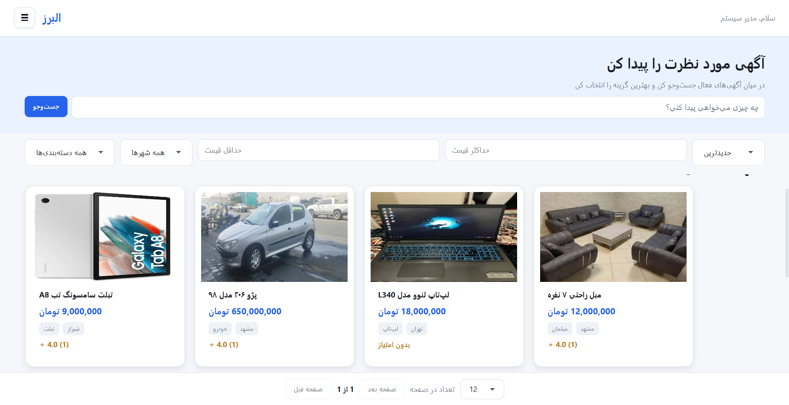
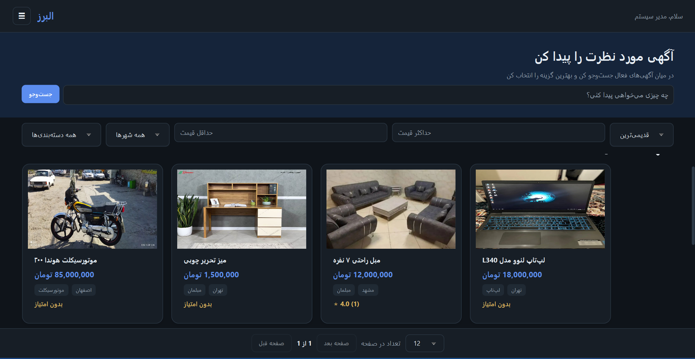
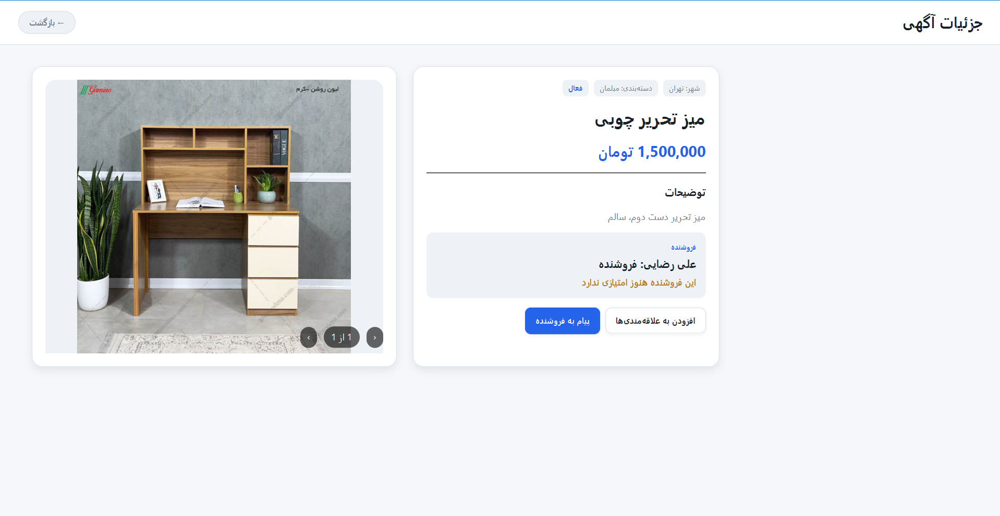
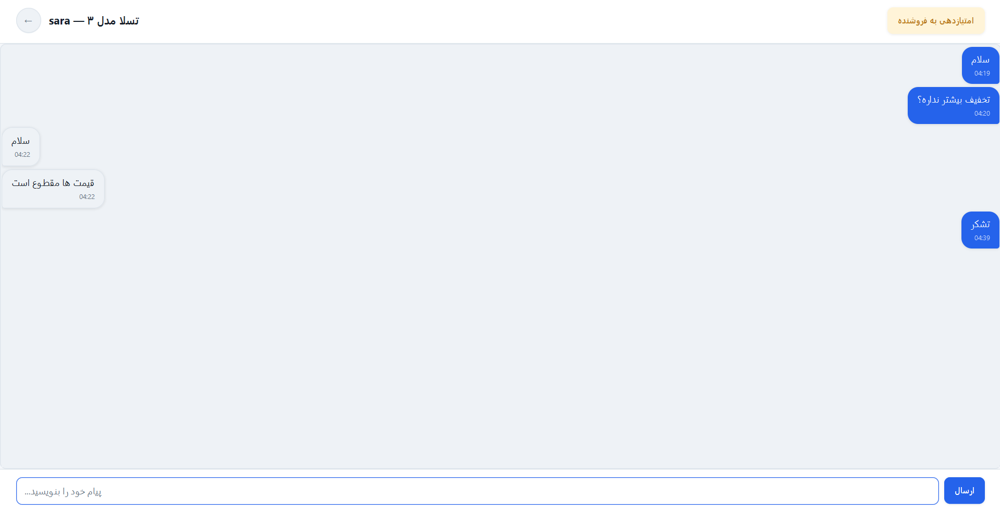
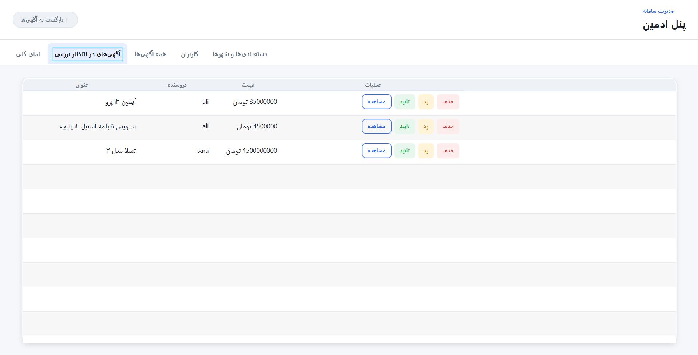

<div align="center">
 
# 🏪 Alborz Secondhand Marketplace
 
A full-stack secondhand-marketplace application — a Spring Boot REST API backend and a JavaFX desktop client — built as an Advanced Programming course project.
 
<p>
  
  
  
</p>
<p>
  
  
  
  
  
</p>
<p>
  <a href="https://github.com/OmidBehzadpoor/SecondHand/actions/workflows/maven.yml"></a>
  <a href="https://github.com/OmidBehzadpoor/SecondHand/actions/workflows/frontend-package.yml"></a>
</p>
</div>
---
 
## 👥 Contributors
- Omid BehzadPour
- Parsa Zebardast
---
 
## 📝 Brief Description of the project
This is an application for secondhand marketing written in Java. The application consists of two separate Maven projects: backend and frontend. These two applications communicate with each other through a REST API.
 
> [!TIP]
> This root README gives the big picture. For setup instructions, environment variables, and the full API reference, see **[`backend/README.md`](backend/README.md)** and **[`frontend/README.md`](frontend/README.md)**.
 
---
 
## 📸 Screenshots
 
<p align="center">
  
  
</p>
<p align="center"><em>Home / browse screen — light &amp; dark mode</em></p>
<p align="center">
  
</p>
<p align="center"><em>Advertisement details</em></p>
<p align="center">
  
  
</p>
<p align="center"><em>Chat between buyer &amp; seller — and the admin panel</em></p>
---
 
## 🧰 Technologies Used
 
### Backend
- **Java 25**
- **Spring Boot 4.1** (Spring Web MVC, Spring Data JPA, Spring Security, Spring Validation)
- **SQLite** as the embedded database, accessed via Hibernate (with the community SQLite dialect)
- **JWT (JJWT library)** for stateless authentication
- **Lombok** to reduce boilerplate code
- **springdoc-openapi (Swagger UI) + Scalar** for interactive API documentation
- **JUnit 5 & Mockito** for unit and integration testing
- **Docker** — a `Dockerfile` is included for containerized builds/deployment
### Frontend
- **Java 25**
- **JavaFX** (`javafx-controls`, `javafx-fxml`) for the desktop graphical user interface, following an MVC-like pattern with FXML views
- **Jackson** (`jackson-databind`, `jackson-datatype-jsr310`) for JSON serialization/deserialization when communicating with the backend REST API
- **Lombok** to reduce boilerplate code
- **JUnit 5** for testing
---
 
## ⚙️ Backend
Backend is implemented using the Spring Boot framework, which provides a robust and scalable foundation for building RESTful APIs. It follows a layered architecture consisting of controllers, services, repositories, and DTOs. The backend handles authentication via JWT (JSON Web Tokens), manages business logic such as advertisement creation, user management, chat, and seller ratings, and exposes secure endpoints for both regular users and administrators. It uses SQLite as its embedded database, which eliminates the need for a separate database installation and makes the setup process straightforward.
 
A hosted instance is publicly available at **[secondhand-6kfg.onrender.com](https://secondhand-6kfg.onrender.com/)** (Render).
 
### Backend's requirements
1. **JDK 25** — this project requires Java 25.
2. **Maven** — for managing dependencies and building the project (version 3.9 or higher).
3. **Internet connection** (only once, not required every time you run the backend) — needed for Maven to download dependencies from Maven Central.
### Data storage
The project uses **SQLite** as its database, so there is no need to install any separate database server. Relevant details:
- The database file (`secondhand.db`) is created automatically, in the directory from which the backend is run (by default, the `backend/` folder), the first time the application starts. The schema (tables) is also generated and updated automatically from the JPA entity classes (`spring.jpa.hibernate.ddl-auto=update`), so no manual migration step is needed.
- Uploaded advertisement images are stored on the local filesystem, under the `uploads/advertisements` folder (relative to where the backend is run) by default. This path can be overridden with the `UPLOAD_DIR` environment variable.
- No additional configuration is required to run the project with the default settings; the database and upload directories are created automatically on first run.
### How to run the backend
1. Through the terminal (using Maven):
```bash
   cd backend
```
   on Linux/Mac: `./mvnw spring-boot:run`
   on Windows: `mvnw.cmd spring-boot:run`
2. Through IntelliJ IDEA:
   Open `SecondhandApplication.java` and click the "Run" icon next to the `main()` method.
 
By default, the server starts on `http://localhost:8080`. It can also be run with Docker — the same `Dockerfile` used for the hosted deployment works locally too, see **[`backend/README.md`](backend/README.md#-running-with-docker)**. For environment variables, the full API endpoint list, and access levels, see the same file.
 
### The general structure of `/backend`
 
```text
backend/
├── src/
│   ├── main/
│   │   ├── java/
│   │   │   └── com/example/secondhand/
│   │   │       ├── config/         # Configuration classes
│   │   │       ├── controller/     # REST Controllers
│   │   │       ├── dto/            # Data Transfer Objects
│   │   │       │   └── response/   # Response DTOs
│   │   │       ├── exception/      # Custom exceptions & handler
│   │   │       ├── model/          # Entities (JPA models)
│   │   │       ├── repository/     # JPA Repositories
│   │   │       ├── security/       # JWT security filter
│   │   │       └── service/        # Business logic
│   │   └── resources/
│   │       ├── application.properties
│   │       └── application-sqlite.properties
│   └── test/                        # Unit/Integration tests
├── pom.xml                          # Maven dependencies
└── ... (mvnw, Dockerfile, etc.)
```
 
---
 
## 🖥️ Frontend
The frontend is a desktop application built with JavaFX, which provides the graphical user interface (GUI). It is organized following an MVC-like pattern, with FXML files defining the views and controllers handling user interactions and navigation. The frontend communicates with the backend through REST API calls, using a custom HTTP client that manages JSON serialization, error handling, and authentication headers. It also includes utilities for session management, theme switching (light/dark mode), form validation, and toast notifications, ensuring a smooth and consistent user experience.
 
> [!NOTE]
> By default the client points at the hosted Render backend above, with no setup needed. Point it at a local backend instead by copying `frontend/config/config.properties.example` to `frontend/config/config.properties` and editing `API_BASE_URL` — see **[`frontend/README.md`](frontend/README.md)**.
 
### Frontend's requirements
1. **JDK 25** — this project requires Java 25.
2. **Maven** — for managing dependencies and building the project (version 3.9 or higher).
3. **Internet connection** — needed once for Maven to download dependencies, and every time the app runs, to reach the backend API.
4. **A backend to talk to** — either the hosted one above (default, zero setup) or your own local instance.
### How to run the frontend
1. Through the terminal (using Maven):
```bash
   cd frontend
```
   on Linux/Mac: `./mvnw javafx:run`
   on Windows: `mvnw.cmd javafx:run`
2. Through IntelliJ IDEA:
   Open `Launcher.java` and click the "Run" icon next to the `main()` method.
 
Note that in order to prevent the JVM's module check from failing to locate separate JavaFX named modules (such as `javafx.graphics`, etc.), we use a `Launcher` class that does not directly extend the `javafx.application.Application` class.
 
> [!TIP]
> Don't want to build from source? A runnable desktop jar for each OS (Windows/macOS/Linux) is published automatically on every push — see **[Downloading a pre-built release](frontend/README.md#-downloading-a-pre-built-release)** in the frontend README.
 
### The general structure of `/frontend`
 
```text
frontend/
├── config/
│   └── config.properties.example    # Template — copy to config.properties to override the backend URL
├── src/
│   └── main/
│       ├── java/
│       │   └── com/example/secondhandfx/
│       │       ├── controller/      # JavaFX Controllers
│       │       ├── exception/       # Custom exceptions
│       │       ├── Launcher.java    # Entry point
│       │       ├── MainApplication.java # Main JavaFX class
│       │       ├── model/           # Data models (DTOs)
│       │       ├── service/         # Services communicating with backend
│       │       └── util/            # Utilities (session, HTTP client, alerts, theme, etc.)
│       └── resources/
│           ├── com/example/secondhandfx/fxml/   # FXML files (views)
│           └── css/                             # Stylesheets (themes & components)
└── pom.xml                          # Maven dependencies
```
 
---
 
<div align="center"> 
   
### 🎓 A University Project

This project was built as the **Advanced Programming** course project at **Amirkabir University of Technology (AUT)**. If you found it useful, a star ⭐ is the best encouragement!

</div>
